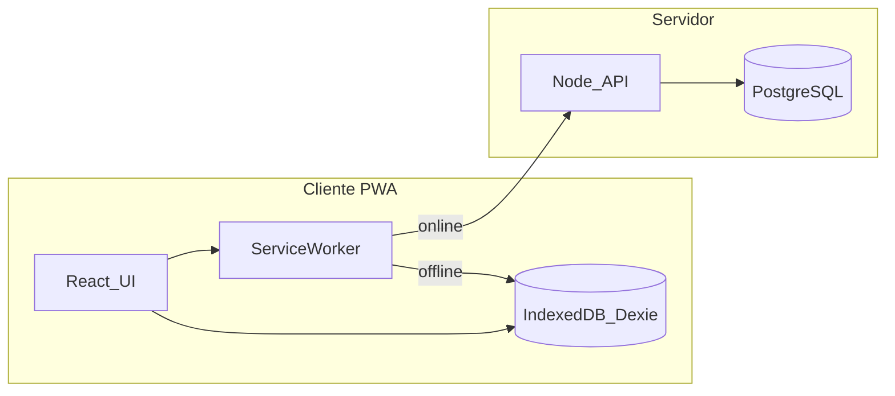

# Refaccionaria Fortino

Sistema de **Punto de Venta (POS)** y **Gestión de Inventario** offline-first para una refaccionaria en Veracruz, México. Diseñado para control interno: catálogo de piezas, ventas ágiles con código de barras y administración de flujo de caja, con continuidad operativa total sin internet.

> **Estado actual:** Fase 0 — setup documental completado. Desarrollo de aplicación pendiente.

## Stack tecnológico

| Capa | Tecnología | Propósito |
|------|------------|-----------|
| **Frontend POS** | React + Vite (PWA) | Interfaz instalable, rápida y reactiva |
| **Offline local** | IndexedDB (Dexie.js) | Caché de catálogo y cola de ventas offline |
| **Backend** | Node.js (Express + TypeScript) | API REST, lógica de negocio y sincronización |
| **Base de datos** | PostgreSQL | Fuente de verdad transaccional (ACID) |
| **Despliegue** | Docker | Contenerización para VPS |

## Arquitectura offline-first

El cliente PWA asume que internet fallará. Usa IndexedDB como capa intermedia y se comunica con el servidor de forma asíncrona.



### Flujo de operación

| Estado | Comportamiento |
|--------|----------------|
| **Online** | Búsqueda en caché local → cobro → envío al backend → PostgreSQL procesa snapshot y resta stock |
| **Offline** | Ventas con precio histórico (snapshot) → cola FIFO en IndexedDB → UI sigue operando |
| **Reconciliación** | Pull de cambios de catálogo → Push de cola FIFO → resolución de conflictos por timestamp |

## Estructura del monorepo (planificada)

```
Refaccionaria-fortino/
├── apps/
│   ├── pos/          # PWA mostrador e inventario  → rama feat/ux
│   ├── landing/      # Sitio público               → rama feat/landing
│   └── api/          # API Node.js                 → rama feat/api
├── packages/
│   └── db/           # Esquema y migraciones       → rama feat/bd
├── .agents/skills/   # Agent skills para Cursor
├── plan.md           # Roadmap de implementación
├── docker-compose.yml
└── README.md
```

## Estrategia de ramas

| Rama | Responsabilidad |
|------|-----------------|
| `main` | Rama estable; merges vía PR |
| `feat/bd` | Esquema PostgreSQL, migraciones Drizzle, seeds, índices |
| `feat/api` | Auth JWT, RBAC, sync `/pull`/`/push`, ventas, caja, auditoría |
| `feat/ux` | PWA POS: Dexie, Service Worker, UI mostrador/inventario/caja |
| `feat/landing` | Sitio público / marketing de la refaccionaria |

```bash
git checkout feat/api      # backend
git checkout feat/ux       # frontend POS
git checkout feat/bd       # base de datos
git checkout feat/landing  # landing page
```

## Requerimientos funcionales (resumen)

- **Auth/RBAC:** login offline con tokens en caché; roles granulares; empleados desactivables (no eliminables).
- **POS:** escaneo de código de barras + búsqueda predictiva; cobro sin ticket físico obligatorio.
- **Inventario:** CRUD con SKU, precios, categoría, stock, imágenes; alertas de stock mínimo.
- **Caja:** ingresos/egresos manuales; apertura/cierre de turnos; reportes PDF/Excel.

## Requerimientos no funcionales

- **Offline-first** con cola FIFO y Background Sync.
- **Snapshot de precios** al momento del cobro (integridad financiera).
- **Logs de auditoría** inmutables para acciones críticas.
- **Lazy loading** de imágenes; prioridad a velocidad de texto/SKU.

## Agent skills (Cursor)

El proyecto incluye skills en [`.agents/skills/`](.agents/skills/) para guiar al agente de IA:

| Skill | Propósito |
|-------|-----------|
| `refaccionaria-blueprint` | Reglas de negocio y módulos del Product Blueprint |
| `refaccionaria-offline-sync` | Patrones Dexie, cola FIFO, endpoints sync |
| `refaccionaria-ui-system` | Montserrat/Inter, dark/light, layouts POS |
| `refaccionaria-git-workflow` | Convención de ramas `feat/*` |
| `react-best-practices`, `vite`, `drizzle`, etc. | Stack técnico (instalados vía autoskills) |
| `production-postgres`, `production-docker` | Patrones de producción para BD y contenedores |

### Instalar o actualizar skills

```bash
npx autoskills -a cursor -y
```

Los skills de dominio custom ya están versionados en el repo. El lockfile `skills-lock.json` registra integridad de skills instalados por autoskills.

## Requisitos de desarrollo

- **Node.js** >= 22
- **Docker** y Docker Compose
- **PostgreSQL** 16 (vía `docker-compose up -d`)

### Infraestructura local (BD)

```bash
docker compose up -d
```

PostgreSQL queda disponible en `localhost:5432` (usuario/contraseña/BD: `refaccionaria`).

## Documentación

- [plan.md](plan.md) — roadmap técnico por fases
- [Repositorio GitHub](https://github.com/tinnlaroli/Refaccionaria-fortino)

## Licencia

Proyecto privado — Refaccionaria Fortino.
