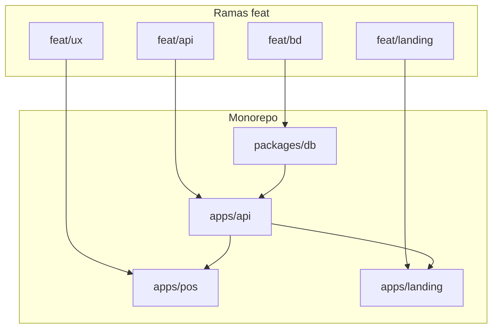
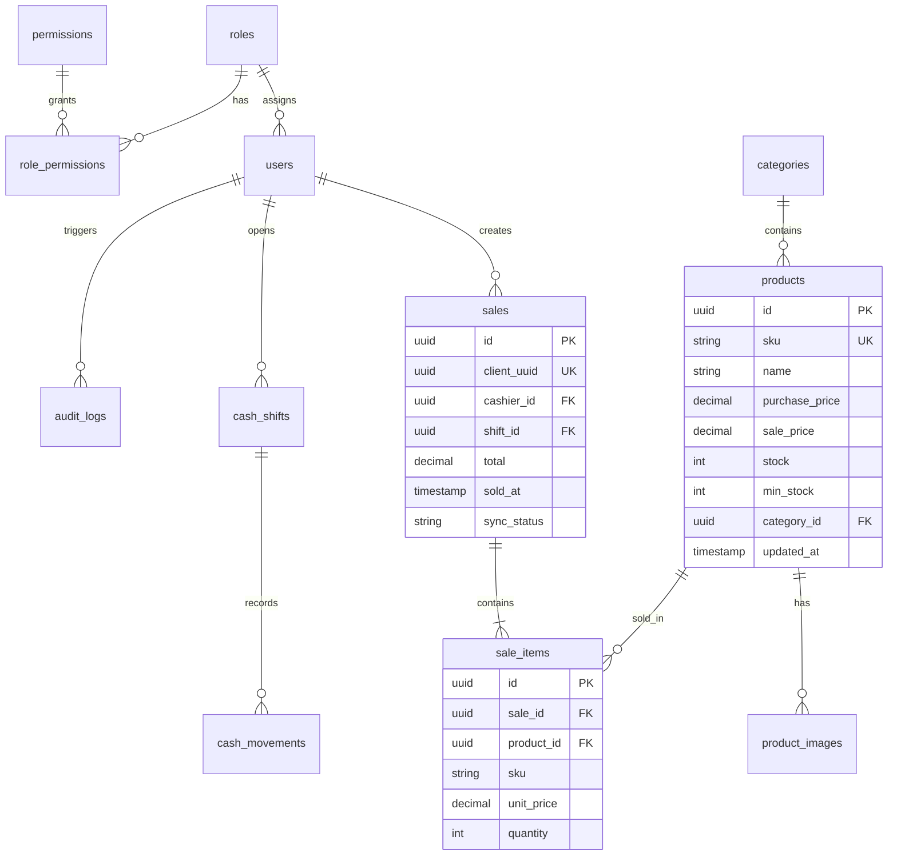
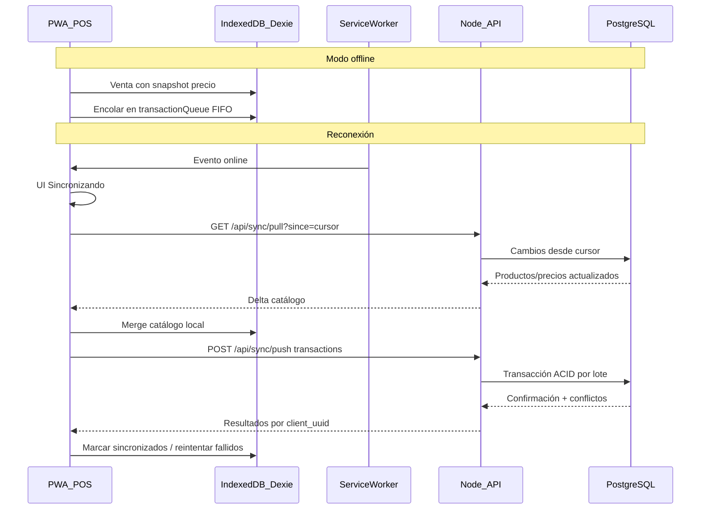

# Plan de implementación — Refaccionaria Fortino

Documento maestro de implementación técnica derivado del Product Blueprint. Define fases, módulos, decisiones arquitectónicas y criterios de aceptación.

---

## 1. Visión y objetivos

Desarrollar un sistema POS + inventario **escalable** y **offline-first** para una refaccionaria en Veracruz. El sistema debe:

- Gestionar catálogo de piezas (repuestos, aceites, etc.) con SKU, precios y stock.
- Procesar ventas ágilmente vía pistola lectora de códigos de barras.
- Administrar flujo de caja con apertura/cierre de turnos.
- Operar **sin interrupciones** cuando falle internet, sincronizando al reconectar.

**Usuarios objetivo:** empleados de mostrador (operación diaria) y administrador (configuración, reportes, empleados).

---

## 2. Decisiones arquitectónicas

| Decisión | Elección | Justificación |
|----------|----------|---------------|
| Backend | **Node.js + Express + TypeScript** | Ecosistema unificado con frontend; tipado compartido |
| ORM | **Drizzle** | Type-safe, migraciones ligeras, buen fit con PostgreSQL |
| Offline | **IndexedDB + Dexie.js** | API Promise-based, índices para búsqueda por SKU |
| Sync | **Pull/Push REST** | Simplicidad; cola FIFO en cliente |
| Precios | **Patrón Snapshot** | Integridad de caja si precios cambian offline |
| Auth | **JWT** con caché local | Login tolerante a fallos de red |
| Deploy | **Docker Compose** | PostgreSQL + API + PWA estática en VPS |

---

## 3. Módulos y mapeo a ramas

| Módulo | Rama | Entregables principales |
|--------|------|-------------------------|
| Base de datos | `feat/bd` | Esquema, migraciones, seeds, índices |
| API backend | `feat/api` | Auth, RBAC, sync, ventas, caja, auditoría |
| PWA POS | `feat/ux` | Dexie, SW, UI mostrador/inventario/caja |
| Landing | `feat/landing` | Sitio público / marketing |

---

## 4. Fases de desarrollo

### Fase 0 — Setup (completada)

- [x] Repositorio clonado y conectado a GitHub
- [x] README, plan.md, agent skills (`.agents/skills/`)
- [x] Ramas `feat/*` creadas
- [x] Monorepo: `apps/api`, `apps/pos`, `apps/landing`, `packages/db`
- [x] Docker Compose unificado en raíz (`main`) — `npm run docker:up`
- [x] Gateway nginx en **http://localhost:8080** (landing + POS + API)
- [x] Scaffolds mínimos ejecutables en cada módulo
- [x] Scripts: `checkout-module.ps1`, `setup-worktrees.ps1`, `sync-branches.ps1`

### Fase 1 — Base de datos (`feat/bd`) — completada

- [x] Proyecto Drizzle en `packages/db/`
- [x] Tablas: users, roles, permissions, role_permissions, products, categories, product_images, sales, sale_items, cash_shifts, cash_movements, audit_logs, sync_cursors
- [x] Migraciones versionadas (`migrations/0000_initial_schema.sql`)
- [x] Seeds: admin, cajero, categorías, productos de prueba
- [x] Índices: `products.sku`, `sales.sold_at`, `audit_logs.created_at`

### Fase 2 — API backend (`feat/api`) — en progreso

- [x] Express + TypeScript en `apps/api/`
- [x] Auth: login, JWT, `/api/auth/me`
- [x] RBAC middleware (`requirePermission`)
- [x] CRUD productos, categorías, usuarios
- [x] Ventas con snapshot de precios + descuento de stock
- [x] Caja: turnos y movimientos
- [x] `GET /api/sync/pull` y `POST /api/sync/push`
- [x] `audit_logs` en acciones críticas
- [ ] Refresh token endpoint y logout
- [ ] OpenAPI / Swagger

### Fase 3 — PWA POS (`feat/ux`) — completada

- [x] React + Vite PWA con `vite-plugin-pwa` (Service Worker)
- [x] Dexie: `products`, `transactionQueue`, `authCache`, `syncMeta`, `shiftCache`
- [x] Login online/offline (sesión en caché)
- [x] Mostrador 70/30: búsqueda SKU, carrito, modal de cobro (glassmorphism)
- [x] Inventario local (tabla alta densidad + alertas de stock)
- [x] Caja: abrir/cerrar turno, movimientos manuales
- [x] Sync pull/push al reconectar; cola offline de ventas
- [x] Banner de conexión + tema dark/light

Criterios de aceptación:
- [x] Venta online vía API; offline en cola IndexedDB
- [x] Snapshot de precio en cada línea del carrito
- [ ] Prueba manual E2E offline en DevTools (recomendado antes de producción)

### Fase 4 — Landing (`feat/landing`) — completada

**Objetivo:** presencia web pública de la refaccionaria.

Entregables:
- [x] Proyecto React/Vite en `apps/landing/`
- [x] Páginas: inicio, catálogo público, contacto/ubicación
- [x] SEO básico (meta, Open Graph), responsive, accesible
- [x] Mismo design system (Montserrat/Inter, dark/light)
- [x] API pública: `GET /api/public/products`, `GET /api/public/categories`

Criterios de aceptación:
- [ ] Lighthouse Performance > 90 en mobile (validar manualmente)
- [x] Información de contacto y ubicación visibles

### Fase 5 — Integración y producción

**Objetivo:** sistema desplegable en VPS.

Entregables:
- [ ] Dockerfile multi-stage para API
- [ ] Docker Compose producción (API + PostgreSQL + nginx para PWA)
- [ ] Variables de entorno documentadas (`.env.example`)
- [ ] Reportes PDF/Excel (caja e inventario)
- [ ] CI básico: lint + typecheck + tests

Criterios de aceptación:
- `docker compose -f docker-compose.prod.yml up` levanta stack completo
- Reporte de corte de caja exportable

---

## 5. Modelo de datos (borrador conceptual)

**Notas:**
- `sales.client_uuid` — UUID generado en cliente para idempotencia de push.
- `sale_items.unit_price` — snapshot; nunca recalcular desde catálogo.
- `audit_logs` — append-only; sin UPDATE/DELETE.

---

## 6. Protocolo de sincronización

### Resolución de conflictos

| Escenario | Resolución |
|-----------|------------|
| Venta offline con snapshot | Aceptar; precio del snapshot prevalece |
| Stock insuficiente al push | Registrar en `audit_logs`; marcar venta como `conflict` |
| Producto eliminado/desactivado | Venta aceptada si existía al `sold_at` |
| Duplicado (mismo `client_uuid`) | Ignorar (idempotente) |

---

## 7. RBAC y permisos granulares

### Roles base (seed)

| Rol | Descripción |
|-----|-------------|
| `admin` | Acceso total; gestión de empleados y roles |
| `cashier` | POS, caja, consulta inventario |
| `viewer` | Solo lectura de inventario y reportes |

### Permisos granulares (ejemplos)

- `products.view`, `products.create`, `products.edit`, `products.view_costs`
- `sales.create`, `sales.cancel`, `sales.view_all`
- `cash.open_shift`, `cash.close_shift`, `cash.register_movement`
- `reports.export`, `users.manage`, `roles.manage`

El administrador crea roles custom seleccionando permisos casilla por casilla.

---

## 8. UI/UX system

| Elemento | Especificación |
|----------|----------------|
| Títulos / branding | Montserrat |
| Tablas / SKUs / finanzas | Inter |
| Temas | Dark (grises oscuros) + Light (blancos humo) obligatorios |
| Glassmorphism | Solo modales de cobro y alertas de conexión |
| Layout mostrador | 70% carrito / 30% totalizador |
| Layout inventario | Tabla alta densidad + miniaturas lazy |

Ver skill `.agents/skills/refaccionaria-ui-system/SKILL.md` para detalle.

---

## 9. Criterios de aceptación globales

- [ ] Sistema opera 8+ horas offline sin pérdida de ventas
- [ ] Reconciliación completa en < 30s para 100 transacciones pendientes
- [ ] Corte de caja cuadra ventas del sistema vs efectivo declarado
- [ ] Cambio de precio online no altera ventas ya cobradas offline
- [ ] Toda acción crítica genera entrada en `audit_logs`
- [ ] Empleado desactivado no puede iniciar sesión (online ni offline cache expirado)

---

## 10. Riesgos y mitigaciones

| Riesgo | Impacto | Mitigación |
|--------|---------|------------|
| Conflictos de stock offline | Ventas que exceden inventario real | Snapshot + audit log + revisión manual |
| Corrupción de cola IndexedDB | Pérdida de ventas | Backup periódico local; UUID idempotente |
| Token JWT expirado offline | Bloqueo de operación | Refresh token en caché; grace period |
| Cambio masivo de precios durante offline | Descuadre aparente | Snapshot por línea; reporte post-sync |
| Saturación RAM por imágenes | Lentitud en mostrador | Lazy loading; thumbnails; priorizar texto |

---

## Referencias

- [README.md](README.md) — overview y setup
- [.agents/skills/](.agents/skills/) — agent skills del proyecto
- [Repositorio GitHub](https://github.com/tinnlaroli/Refaccionaria-fortino)
